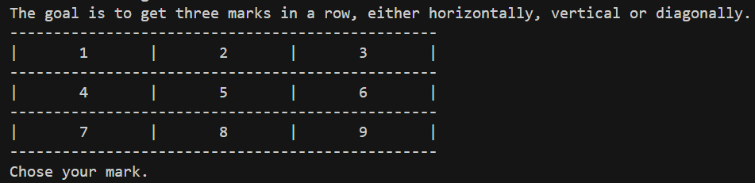
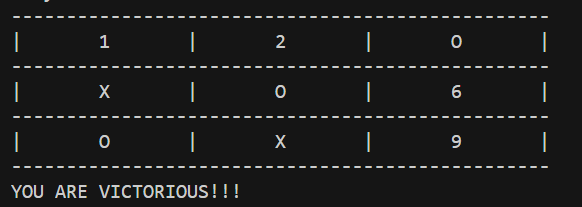

# Tic Tac Toe

This is a simple, terminal-based, tic tac toe game.
You are playing against the computer and the goal is to get three in row,
either horizontally, vertically or diagonally.

Choose the desired placement by entering the corresponding number.
The user play with the mark `O`.
The computer play with the mark `X`.

To compile with the makefile on windows, us the command `mingw32-make`
